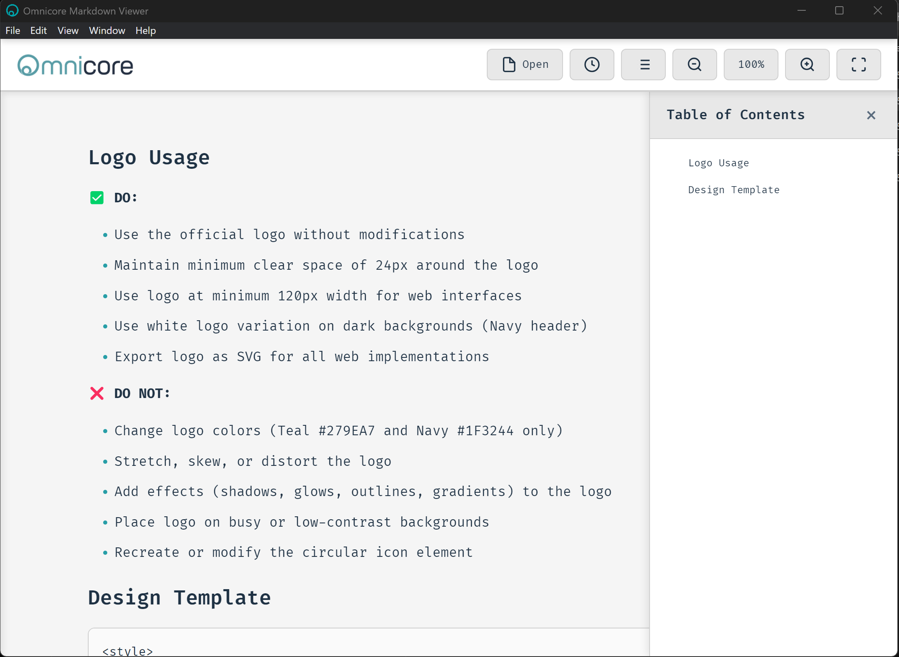
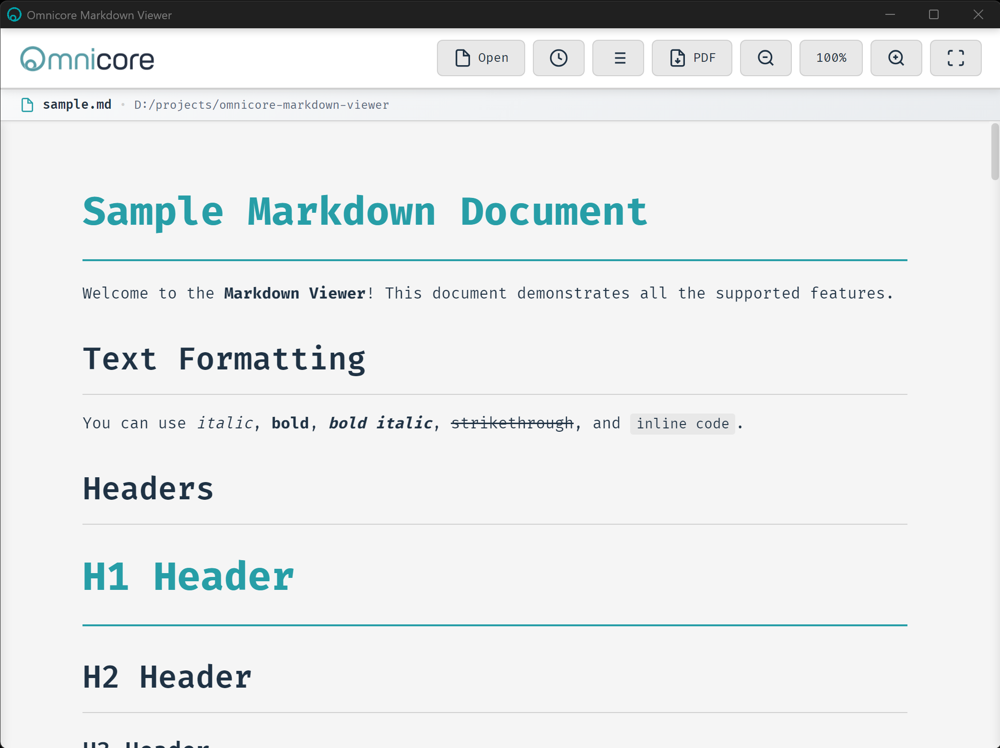
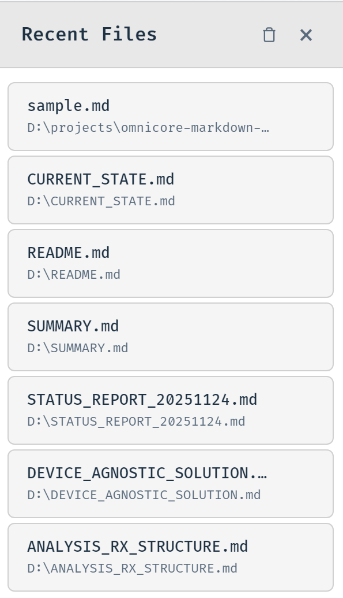
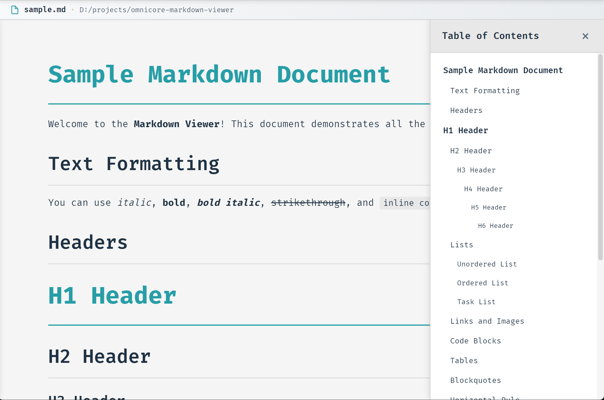
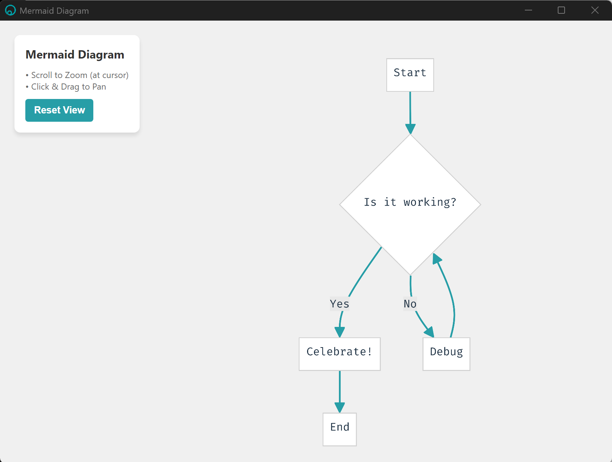
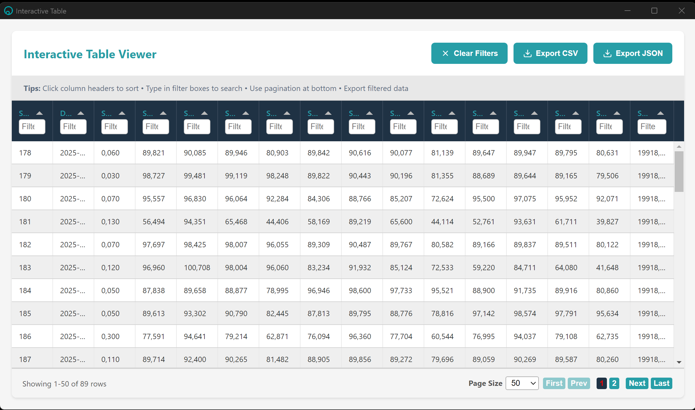

# Omnicore Markdown Viewer

<div align="center">
  
  <p><strong>A sleek, cross-platform markdown viewer with full HTML support, Mermaid diagram rendering, and powerful note-taking</strong></p>
</div>


## Features

### Core Rendering
- **Full HTML Support** - Render HTML tags within markdown with DOMPurify sanitization
- **Mermaid Diagrams** - Beautiful diagram rendering with interactive popup viewer featuring pan/zoom controls
- **OmniWare Wireframes** - Built-in wireframe diagram support
- **PrismJS Syntax Highlighting** - Code blocks with Solarized Light theme (offline support for 11+ languages)
- **Interactive Tables** - Tabulator.js integration with sorting, filtering, pagination, and CSV/JSON export

### Editing & Export
- **Live Markdown Editor** - Split-view editing with 3-second debounced preview and Fira Code font
- **Inline Text Editing** - Right-click any selected text to edit it in place with partial rendering (no full page refresh)
- **PDF Export** - One-click export with full styling, diagrams, and syntax highlighting
- **Word Export** - Export documents as Microsoft Word (.docx) files
- **Auto-Save Detection** - Unsaved changes indicator with confirmation prompts

### Note System
- **Text Notes** - Select any text and add colored notes with title and content
- **Image Notes** - Annotate images with notes
- **Note Labels** - Place floating label badges anywhere in the document
- **All Notes Panel** - Side panel listing all notes sorted by ID with search functionality
- **Note Search** - Search notes by ID or title, with auto-scroll to matching note
- **Find Note** - Quick note lookup via right-click context menu
- **Show/Hide Notes** - Toggle note visibility from the View menu
- **Edit & Delete Notes** - Right-click context menu on notes for editing and deletion
- **6 Color Options** - Orange, red, green, blue, purple, yellow

### Navigation & UI
- **Dropdown Menus** - Organized File, View, and Tools dropdown menus
  - **File** - Open, Table of Contents, Edit Mode, All Notes, Export (PDF/Word), Recent Files
  - **View** - Zoom, Dark Mode, Fullscreen, Show/Hide Notes
  - **Tools** - Language settings (Document translation & Interface language)
- **Auto Table of Contents** - Hierarchical index of all headers (H1-H6) with one-click navigation
- **Search with Highlighting** - Real-time text search with match counter and keyboard navigation (Ctrl+F)
- **File Path Display** - Shows current file path with copy-to-clipboard functionality

### View Controls
- **Dark Mode** - Toggle between light and dark themes
- **Zoom Controls** - Flexible zoom from 50% to 200% via keyboard shortcuts or mouse wheel
- **Fullscreen Mode** - Distraction-free viewing (F11)

### Translation & Localization
- **Document Translation** - Translate documents to English or Turkish via Google Translate
- **Interface Language** - Switch UI language between English and Turkish
- **Dual-source Editing** - Edit documents while viewing translations without switching back

### Right-Click Context Menu
- **Copy / Copy as Plain Text**
- **Edit Text** - Edit selected text inline with partial DOM rendering
- **Bold / Italic / Code Block / List** - Quick formatting
- **Remove Formatting** - Strip markdown formatting from selection
- **Add Note / Edit Note / Delete Note / Find Note** - Full note management
- **Insert Image / Delete Image**
- **Select All**

### Additional Features
- **Professional Theme** - Clean interface with Omnicore branding (#279EA7 teal, #1F3244 navy)
- **Cross-Platform** - Works on Windows, macOS, and Linux
- **Offline Support** - All libraries bundled locally, no internet required
- **Single Instance** - Prevents multiple app instances
- **Toast Notifications** - User-friendly feedback for all operations
- **Recent Files** - Quick access to last 100 files from File menu

## Installation

### Download Pre-built Releases

Download the latest release from the [Releases page](https://github.com/OmniCoreST/omnicore-markdown-viewer/releases):

| Platform | File | Description |
|----------|------|-------------|
| Windows | `Omnicore-Markdown-Viewer-Setup-X.X.X.exe` | Windows installer |
| Linux | `Omnicore.Markdown.Viewer-X.X.X.AppImage` | Portable AppImage |
| Linux | `omnicore-markdown-viewer_X.X.X_amd64.deb` | Debian/Ubuntu package |

### Windows Installation Note

> **"Windows protected your PC" Warning**
>
> On first run, Windows SmartScreen may show a warning because the app is not code-signed.
>
> **To proceed:**
> 1. Click **"More info"**
> 2. Click **"Run anyway"**
>
> This is safe - you can verify the source code in this repository.

### Build from Source

1. Install dependencies:
```bash
npm install
```

## Running the Application

Start the application in development mode:
```bash
npm start
```

## Building for Production

### Standalone Portable EXE (No Installation Required)
```bash
npm run build
```
This creates a portable `.exe` file in `dist/` folder that can run without installation.

### Windows Installer (NSIS)
```bash
npm run build-installer
```
This creates a Windows installer in `dist/` folder.

### Build Both
```bash
npm run build-all
```
This creates both portable exe and installer.

**Output location:** `dist/` folder

## Controls

### Keyboard Shortcuts

- **Ctrl+O** (Cmd+O on Mac) - Open markdown file
- **Ctrl+S** (Cmd+S on Mac) - Save file (in edit mode)
- **Ctrl+F** (Cmd+F on Mac) - Open search panel
- **Ctrl+B** - Bold selected text
- **Ctrl+I** - Italic selected text
- **Ctrl+`** - Code block
- **Enter** (in search) - Next match
- **Shift+Enter** (in search) - Previous match
- **Escape** - Close search panel / Exit dialogs
- **Ctrl++** - Zoom in
- **Ctrl+-** - Zoom out
- **Ctrl+0** - Reset zoom to 100%
- **Ctrl+Enter** - Save in Edit Text dialog
- **F11** - Toggle fullscreen

### Mouse Controls

- **Ctrl+Mouse Wheel** (Cmd+Mouse Wheel on Mac) - Zoom in/out
  - Scroll up to zoom in
  - Scroll down to zoom out
- **Right-click** - Context menu with formatting, notes, and editing options

### Search Features

- **Real-time highlighting** - Matches are highlighted as you type
- **Match counter** - Shows current match and total matches (e.g., "3 of 15")
- **Navigation** - Use arrow buttons or Enter/Shift+Enter to navigate
- **Case-insensitive** - Searches ignore case differences
- **Minimum 2 characters** - Search activates after typing at least 2 characters

### Table of Contents

- **Auto-generated** - Automatically extracts all headers (H1-H6) from document
- **Hierarchical display** - Shows header levels with indentation
- **One-click navigation** - Click any header to jump to that section
- **Active highlighting** - Current section is highlighted in the TOC
- **Accessible from File menu** - Toggle via File > Table of Contents

## Supported File Types

- `.md` - Markdown
- `.markdown` - Markdown
- `.mdown` - Markdown
- `.mkd` - Markdown
- `.mkdn` - Markdown

## Opening Files

### Method 1: Within the App
- Press `Ctrl+O` or use File > Open File
- Access recent files from File > History section

### Method 2: Windows "Open With"
- Right-click any `.md` file in Windows Explorer
- Select "Open with" > "Omnicore Markdown Viewer"
- The file opens directly in the app

### Method 3: Default Program (After Installer)
- The NSIS installer registers the app for `.md` files
- You can set it as the default program for markdown files
- Double-click any `.md` file to open in Omnicore Markdown Viewer

## Mermaid Support

The viewer supports all Mermaid diagram types. Simply use mermaid code blocks:

\`\`\`mermaid
graph TD
    A[Start] --> B[Process]
    B --> C[End]
\`\`\`

## Technology Stack

- **Electron 27.0** - Cross-platform desktop framework
- **Marked** - Fast markdown parser with full GFM support
- **Mermaid** - Diagram rendering engine (flowcharts, sequence diagrams, etc.)
- **Tabulator.js 6.2.5** - Interactive table library with advanced features
- **PrismJS** - Syntax highlighting for code blocks (11+ languages)
- **DOMPurify** - XSS protection via HTML sanitization
- **Fira Code** - Beautiful monospace font for code editing

## Screenshots

### Main Interface with Table of Contents
<div align="center">
  
  <p><em>Clean interface showing markdown rendering with Table of Contents sidebar</em></p>
</div>

### File Path Display and Toolbar
<div align="center">
  
  <p><em>Toolbar with File, View, and Tools dropdown menus</em></p>
</div>

### Recent Files Manager
<div align="center">
  
  <p><em>Quick access to recently opened files from File menu</em></p>
</div>

### Hierarchical Table of Contents
<div align="center">
  
  <p><em>Auto-generated TOC showing all document headers with hierarchical indentation</em></p>
</div>

### Mermaid Diagram Popup Viewer
<div align="center">
  
  <p><em>Interactive Mermaid popup window with pan (click & drag) and zoom (scroll wheel) controls</em></p>
</div>

### Interactive Table Viewer (Tabulator.js)
<div align="center">
  
  <p><em>Advanced table viewer with column sorting, filtering, pagination, and CSV/JSON export</em></p>
</div>

## Contributing

Contributions are welcome! Please feel free to submit a Pull Request.

1. Fork the repository
2. Create your feature branch (`git checkout -b feature/AmazingFeature`)
3. Commit your changes (`git commit -m 'Add some AmazingFeature'`)
4. Push to the branch (`git push origin feature/AmazingFeature`)
5. Open a Pull Request

## Development

```bash
# Install dependencies
npm install

# Run in development mode
npm start

# Build for Windows
npm run build-all
```

## License

MIT License - see the [LICENSE](LICENSE) file for details

## Credits

Developed by [Omnicore](https://www.omnicore.com.tr)
