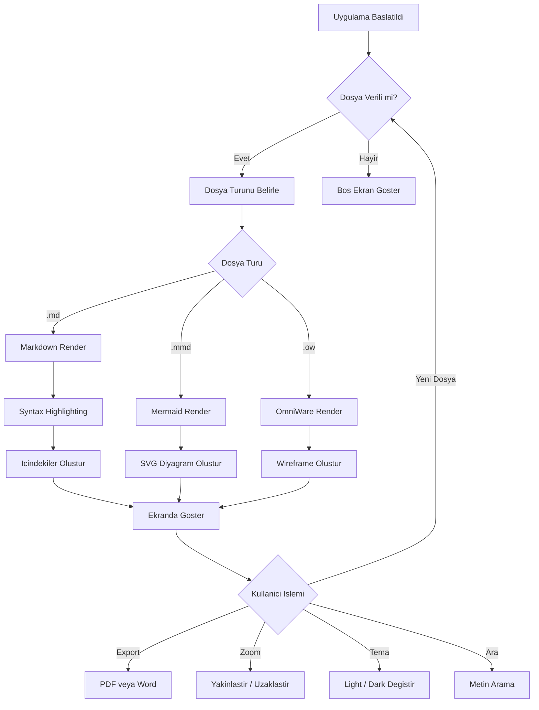
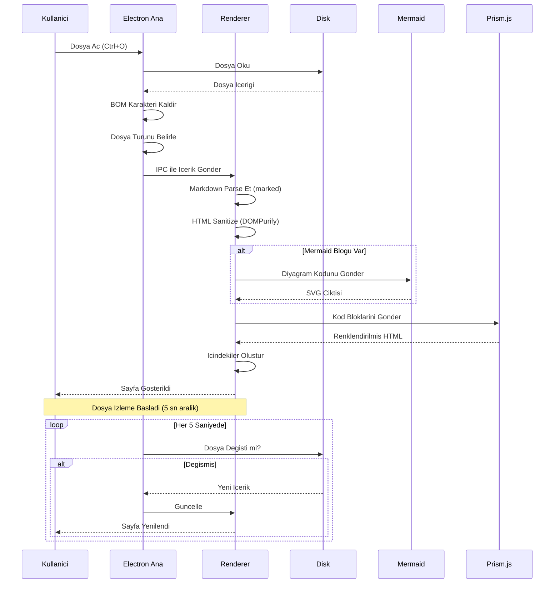
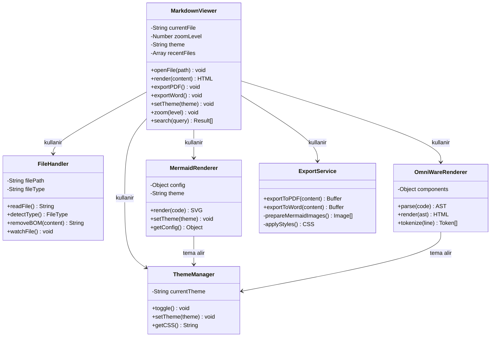
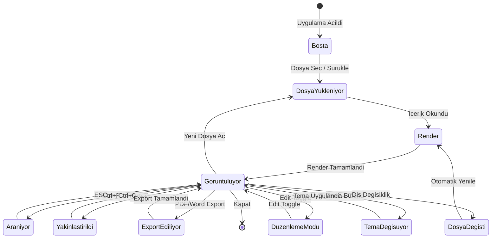
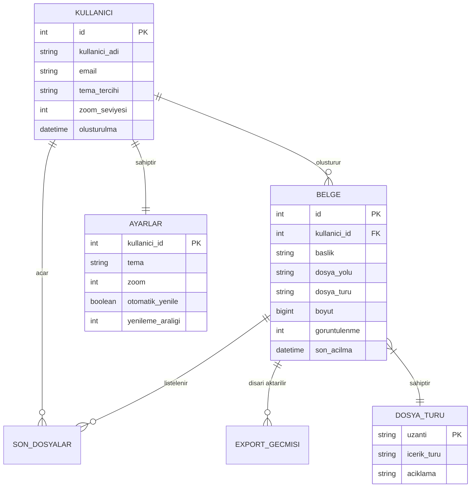
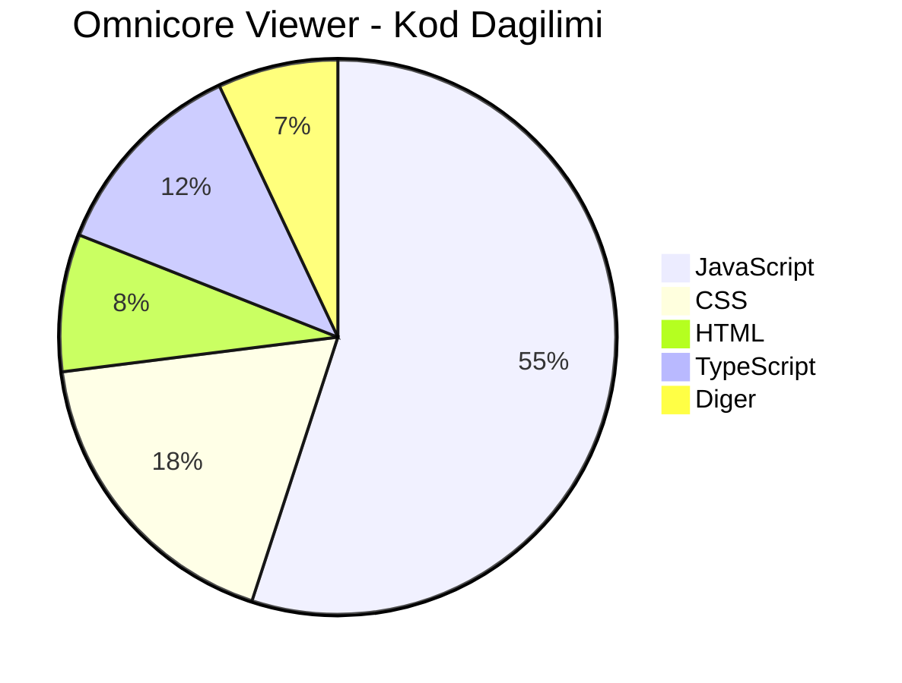
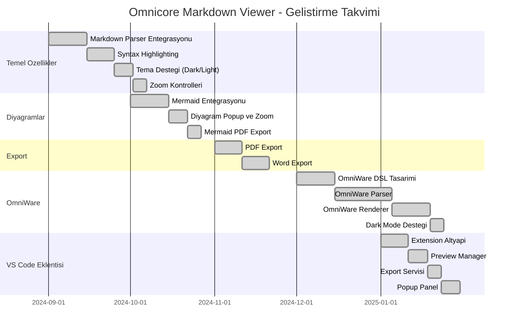
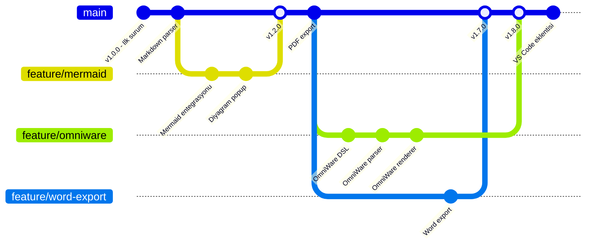
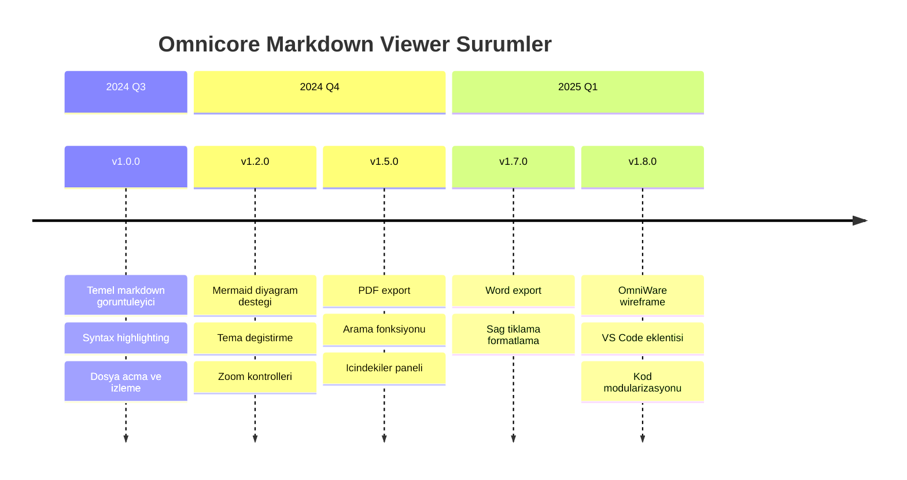

# Omnicore Markdown Viewer - Kapsamli Ozellik Demosu

Bu belge, **Omnicore Markdown Viewer** uygulamasinin destekledigi tum ozellikleri gostermek amaciyla hazirlanmistir. Uygulama; Markdown, Mermaid diyagramlari ve OmniWare wireframe destegi sunmaktadir.

---

## Icerik Tablosu

- [Metin Bicimlendirme](#metin-bicimlendirme)
- [Basliklar](#basliklar)
- [Listeler](#listeler)
- [Tablolar](#tablolar)
- [Kod Bloklari](#kod-bloklari)
- [Mermaid Diyagramlari](#mermaid-diyagramlari)
- [OmniWare Wireframe](#omniware-wireframe)
- [Blockquote ve Alinti](#blockquote-ve-alinti)
- [Baglantilar ve Gorseller](#baglantilar-ve-gorseller)
- [HTML Destegi](#html-destegi)
- [Emoji Destegi](#emoji-destegi)
- [Klavye Kisayollari](#klavye-kisayollari)

---

## Metin Bicimlendirme

Omnicore Markdown Viewer, zengin metin bicimlendirme secenekleri sunar:

- **Kalin metin** `**kalin**` ile yazilir
- *Italik metin* `*italik*` ile yazilir
- ***Kalin ve italik*** `***kalin ve italik***` ile yazilir
- ~~Ustu cizili metin~~ `~~ustu cizili~~` ile yazilir
- `Satir ici kod` ters tikla yazilir
- Normal metin icinde **kalin**, *italik* ve `kod` bir arada kullanilabilir.

### Alt Yazi ve Ust Yazi

Kimyasal formullerde ve matematiksel ifadelerde kullanislidir:

- Su formulu: H<sub>2</sub>O
- Karbondioksit: CO<sub>2</sub>
- Einstein denklemi: E = mc<sup>2</sup>
- Uslu sayi: 2<sup>10</sup> = 1024
- Polinom: x<sup>3</sup> + 2x<sup>2</sup> - 5x + 1

---

## Basliklar

Markdown'da 6 seviye baslik kullanilabilir. Her biri farkli buyuklukte gosterilir:

# H1 - Birinci Seviye Baslik
## H2 - Ikinci Seviye Baslik
### H3 - Ucuncu Seviye Baslik
#### H4 - Dorduncu Seviye Baslik
##### H5 - Besinci Seviye Baslik
###### H6 - Altinci Seviye Baslik

Basliklar otomatik olarak sag paneldeki **Icindekiler** listesine eklenir ve tiklanabilir hale gelir.

---

## Listeler

### Sirasiz Liste

- Birinci madde
- Ikinci madde
  - Ic ice madde 2.1
  - Ic ice madde 2.2
    - Daha derin madde 2.2.1
    - Daha derin madde 2.2.2
  - Ic ice madde 2.3
- Ucuncu madde
- Dorduncu madde

### Sirali Liste

1. Projeyi klonlayin
2. Bagimliliklari yukleyin
3. Uygulamayi baslatim
   1. Gelistirme modunda calistirma
   2. Uretim modunda calistirma
4. Testleri calistirin
5. Build alin

### Gorev Listesi

- [x] Markdown parser entegrasyonu
- [x] Mermaid diyagram destegi
- [x] Kod syntax highlighting
- [x] Dark mode / Light mode
- [x] PDF export
- [x] Word (.docx) export
- [x] Zoom kontrolleri
- [x] Arama fonksiyonu
- [x] OmniWare wireframe destegi
- [ ] LaTeX matematik formul destegi
- [ ] Markdown editor iyilestirmeleri
- [ ] Eklenti sistemi

### Karisik Liste

1. **Frontend Teknolojileri**
   - HTML5 ve CSS3
   - JavaScript (ES6+)
   - Electron Framework
2. **Kullanilan Kutuphaneler**
   - `marked` - Markdown parser
   - `mermaid` - Diyagram render
   - `prismjs` - Syntax highlighting
   - `dompurify` - HTML sanitization
   - `html2canvas` - Canvas donusturme
   - `html-to-docx` - Word export
3. **Gelistirme Araclari**
   - Node.js
   - npm
   - electron-builder

---

## Tablolar

### Basit Tablo

| Ozellik | Durum | Oncelik |
|---------|-------|---------|
| Markdown Render | Tamamlandi | Yuksek |
| Mermaid Destek | Tamamlandi | Yuksek |
| OmniWare Destek | Tamamlandi | Yuksek |
| PDF Export | Tamamlandi | Orta |
| Word Export | Tamamlandi | Orta |
| Zoom Kontrol | Tamamlandi | Dusuk |

### Hizalamali Tablo

Tablolarda sol, orta ve sag hizalama yapilabilir:

| Sol Hizali | Orta Hizali | Sag Hizali |
|:-----------|:-----------:|----------:|
| Metin | Metin | Metin |
| Sol | Orta | Sag |
| Uzun metin ornegi | Kisa | 1.234,56 TL |
| Bir deger daha | Ortalanmis | 99,99 USD |

### Kapsamli Veri Tablosu

Bu tablo, Tabulator popup ozelligini (maksimize butonu) test etmek icin daha fazla veri icerir:

| # | Modul | Dosya | Satir Sayisi | Boyut | Durum | Son Guncelleme |
|---|-------|-------|-------------|-------|-------|----------------|
| 1 | Ana Islem | main.js | 258 | 12 KB | Aktif | 2025-01-15 |
| 2 | Renderer | renderer.js | 331 | 18 KB | Aktif | 2025-01-15 |
| 3 | Stiller | styles.css | 850 | 22 KB | Aktif | 2025-01-14 |
| 4 | Arayuz | index.html | 320 | 8 KB | Aktif | 2025-01-13 |
| 5 | Mermaid Konfig | mermaid-config.js | 63 | 2 KB | Aktif | 2025-01-15 |
| 6 | OmniWare Konfig | omniware-config.js | 79 | 3 KB | Aktif | 2025-01-15 |
| 7 | Dosya Yardimci | file-helpers.js | 140 | 4 KB | Aktif | 2025-01-15 |
| 8 | Bildirimler | notification-helpers.js | 55 | 2 KB | Aktif | 2025-01-15 |
| 9 | Sag Tik Menu | context-menu-utils.js | 45 | 1 KB | Aktif | 2025-01-15 |
| 10 | Yardimcilar | utils.js | 68 | 2 KB | Aktif | 2025-01-15 |
| 11 | OmniWare Motor | omniwire/omniware.js | 1174 | 45 KB | Aktif | 2025-01-15 |
| 12 | VS Code Eklenti | vscode-extension/src/extension.ts | 63 | 3 KB | Aktif | 2025-01-15 |
| 13 | VS Code Preview | vscode-extension/src/previewManager.ts | 314 | 14 KB | Aktif | 2025-01-15 |
| 14 | VS Code Export | vscode-extension/src/exportService.ts | 107 | 5 KB | Aktif | 2025-01-15 |
| 15 | VS Code Popup | vscode-extension/src/popupPanelManager.ts | 411 | 18 KB | Aktif | 2025-01-15 |

### Genis Tablo (5+ Sutun - Kompakt Mod)

| Ay | Gelir | Gider | Kar | Kar Marji | Calisan | Proje | Musteri | Memnuniyet |
|----|-------|-------|-----|----------|---------|-------|---------|------------|
| Ocak | 150.000 | 120.000 | 30.000 | %20 | 45 | 12 | 38 | %92 |
| Subat | 165.000 | 125.000 | 40.000 | %24 | 47 | 14 | 41 | %94 |
| Mart | 180.000 | 130.000 | 50.000 | %28 | 50 | 15 | 45 | %91 |
| Nisan | 175.000 | 128.000 | 47.000 | %27 | 50 | 16 | 43 | %93 |
| Mayis | 190.000 | 135.000 | 55.000 | %29 | 52 | 17 | 48 | %95 |
| Haziran | 200.000 | 140.000 | 60.000 | %30 | 55 | 18 | 50 | %96 |

---

## Kod Bloklari

Omnicore Markdown Viewer, **Prism.js** ile 100'den fazla programlama dilinde syntax highlighting destegi sunar.

### JavaScript

```javascript
// Omnicore Markdown Viewer - Ornek Modul
class MarkdownRenderer {
  constructor(options = {}) {
    this.theme = options.theme || 'light';
    this.zoomLevel = options.zoomLevel || 100;
    this.plugins = new Map();
  }

  async render(content) {
    const sanitized = DOMPurify.sanitize(content);
    const html = marked.parse(sanitized);

    // Mermaid diyagramlarini isle
    const mermaidBlocks = html.match(/```mermaid[\s\S]*?```/g);
    if (mermaidBlocks) {
      for (const block of mermaidBlocks) {
        const svg = await mermaid.render(block);
        html.replace(block, svg);
      }
    }

    return html;
  }

  setTheme(theme) {
    this.theme = theme;
    document.body.classList.toggle('dark-mode', theme === 'dark');
    console.log(`Tema degistirildi: ${theme}`);
  }

  zoom(level) {
    this.zoomLevel = Math.min(200, Math.max(50, level));
    document.body.style.zoom = `${this.zoomLevel}%`;
  }
}

const viewer = new MarkdownRenderer({ theme: 'dark' });
viewer.render('# Merhaba Dunya');
```

### Python

```python
import os
import json
from pathlib import Path
from dataclasses import dataclass, field
from typing import Optional

@dataclass
class MarkdownDocument:
    """Markdown belge sinifi."""
    title: str
    content: str
    file_path: Path
    metadata: dict = field(default_factory=dict)
    word_count: int = 0

    def __post_init__(self):
        self.word_count = len(self.content.split())

    def export_to_html(self) -> str:
        """Markdown icerigini HTML'e donusturur."""
        import markdown
        extensions = ['tables', 'fenced_code', 'codehilite', 'toc']
        return markdown.markdown(self.content, extensions=extensions)

    def save(self, output_path: Optional[Path] = None):
        """Belgeyi diske kaydeder."""
        path = output_path or self.file_path
        path.write_text(self.content, encoding='utf-8')
        print(f"Belge kaydedildi: {path}")

    @classmethod
    def from_file(cls, file_path: str) -> 'MarkdownDocument':
        """Dosyadan MarkdownDocument olusturur."""
        path = Path(file_path)
        if not path.exists():
            raise FileNotFoundError(f"Dosya bulunamadi: {file_path}")

        content = path.read_text(encoding='utf-8')
        # BOM karakterini kaldir
        if content.startswith('\ufeff'):
            content = content[1:]

        title = content.split('\n')[0].lstrip('# ').strip()
        return cls(title=title, content=content, file_path=path)


# Kullanim ornegi
if __name__ == '__main__':
    doc = MarkdownDocument.from_file('README.md')
    print(f"Baslik: {doc.title}")
    print(f"Kelime Sayisi: {doc.word_count}")
    html = doc.export_to_html()
```

### TypeScript

```typescript
interface ViewerConfig {
  theme: 'light' | 'dark';
  zoomLevel: number;
  recentFiles: string[];
  maxRecentFiles: number;
  autoRefresh: boolean;
  refreshInterval: number;
}

interface ExportOptions {
  format: 'pdf' | 'docx' | 'html';
  includeStyles: boolean;
  pageSize: 'A4' | 'Letter';
  margins: { top: number; right: number; bottom: number; left: number };
}

class OmnicoreViewer {
  private config: ViewerConfig;
  private currentFile: string | null = null;
  private history: string[] = [];
  private historyIndex: number = -1;

  constructor(config: Partial<ViewerConfig> = {}) {
    this.config = {
      theme: config.theme ?? 'light',
      zoomLevel: config.zoomLevel ?? 100,
      recentFiles: config.recentFiles ?? [],
      maxRecentFiles: config.maxRecentFiles ?? 100,
      autoRefresh: config.autoRefresh ?? true,
      refreshInterval: config.refreshInterval ?? 5000,
    };
  }

  async openFile(filePath: string): Promise<void> {
    this.currentFile = filePath;
    this.addToHistory(filePath);
    this.addToRecentFiles(filePath);
  }

  async exportDocument(options: ExportOptions): Promise<Buffer> {
    if (!this.currentFile) {
      throw new Error('Acik dosya yok');
    }
    // Export islemi...
    return Buffer.from('');
  }

  private addToHistory(filePath: string): void {
    this.history = this.history.slice(0, this.historyIndex + 1);
    this.history.push(filePath);
    this.historyIndex = this.history.length - 1;
  }

  private addToRecentFiles(filePath: string): void {
    const { recentFiles, maxRecentFiles } = this.config;
    const filtered = recentFiles.filter(f => f !== filePath);
    filtered.unshift(filePath);
    this.config.recentFiles = filtered.slice(0, maxRecentFiles);
  }
}
```

### HTML ve CSS

```html
<!DOCTYPE html>
<html lang="tr">
<head>
  <meta charset="UTF-8">
  <meta name="viewport" content="width=device-width, initial-scale=1.0">
  <title>Omnicore Markdown Viewer</title>
  <link rel="stylesheet" href="styles.css">
</head>
<body>
  <header class="toolbar">
    <div class="toolbar-left">
      <button id="openFileBtn" title="Dosya Ac (Ctrl+O)">Dosya Ac</button>
      <button id="refreshBtn" title="Yenile (Ctrl+R)">Yenile</button>
    </div>
    <div class="toolbar-center">
      <span id="fileNameDisplay">Dosya secilmedi</span>
    </div>
    <div class="toolbar-right">
      <button id="themeToggle">Tema</button>
      <div class="zoom-controls">
        <button id="zoomOut">-</button>
        <span id="zoomLevel">100%</span>
        <button id="zoomIn">+</button>
      </div>
    </div>
  </header>
  <main id="content" class="markdown-body"></main>
</body>
</html>
```

```css
/* Omnicore Markdown Viewer - Tema Degiskenleri */
:root {
  --bg-primary: #f5f5f5;
  --bg-secondary: #ffffff;
  --text-primary: #333333;
  --text-secondary: #666666;
  --accent-color: #279EA7;
  --border-color: #e0e0e0;
  --code-bg: #f8f8f8;
  --font-code: 'Fira Code', monospace;
  --font-body: 'Segoe UI', Calibri, Arial, sans-serif;
}

.dark-mode {
  --bg-primary: #1a1a1a;
  --bg-secondary: #242424;
  --text-primary: #e0e0e0;
  --text-secondary: #aaaaaa;
  --accent-color: #3DBDC6;
  --border-color: #444444;
  --code-bg: #2d2d2d;
}

.markdown-body {
  max-width: 900px;
  margin: 0 auto;
  padding: 2rem;
  font-family: var(--font-body);
  color: var(--text-primary);
  background-color: var(--bg-secondary);
  line-height: 1.7;
}

.markdown-body h1 {
  color: var(--accent-color);
  border-bottom: 2px solid var(--accent-color);
  padding-bottom: 0.5rem;
}

.markdown-body code {
  font-family: var(--font-code);
  background-color: var(--code-bg);
  padding: 0.2em 0.4em;
  border-radius: 4px;
  font-size: 0.9em;
}

.markdown-body pre {
  background-color: var(--code-bg);
  border-radius: 8px;
  padding: 1rem;
  overflow-x: auto;
}
```

### Bash / Shell

```bash
#!/bin/bash
# Omnicore Markdown Viewer - Build ve Release Scripti

set -euo pipefail

VERSION=$(node -p "require('./package.json').version")
APP_NAME="omnicore-markdown-viewer"
BUILD_DIR="./dist"

echo "=== Omnicore Markdown Viewer v${VERSION} Build Baslatiliyor ==="

# Temizlik
if [ -d "$BUILD_DIR" ]; then
  rm -rf "$BUILD_DIR"
  echo "Onceki build temizlendi."
fi

# Bagimliliklari yukle
echo "Bagimliliklar yukleniyor..."
npm ci --production=false

# Lint kontrolu
echo "Kod kalitesi kontrol ediliyor..."
npm run lint || { echo "Lint hatalari bulundu!"; exit 1; }

# Build al
echo "Uygulama derleniyor..."
npm run build

# Platform bazli paketleme
case "$(uname -s)" in
  Linux*)
    echo "Linux paketleri olusturuluyor..."
    npx electron-builder --linux deb AppImage
    ;;
  Darwin*)
    echo "macOS paketi olusturuluyor..."
    npx electron-builder --mac dmg
    ;;
  MINGW*|CYGWIN*)
    echo "Windows paketleri olusturuluyor..."
    npx electron-builder --win portable nsis
    ;;
esac

echo "=== Build tamamlandi! ==="
echo "Cikti dizini: ${BUILD_DIR}"
ls -lh "${BUILD_DIR}/"
```

### SQL

```sql
-- Omnicore Kullanici ve Dosya Yonetim Veritabani

CREATE TABLE users (
    id          SERIAL PRIMARY KEY,
    username    VARCHAR(50) NOT NULL UNIQUE,
    email       VARCHAR(100) NOT NULL UNIQUE,
    full_name   VARCHAR(150),
    theme_pref  VARCHAR(10) DEFAULT 'light' CHECK (theme_pref IN ('light', 'dark')),
    zoom_level  INTEGER DEFAULT 100 CHECK (zoom_level BETWEEN 50 AND 200),
    created_at  TIMESTAMP DEFAULT CURRENT_TIMESTAMP,
    updated_at  TIMESTAMP DEFAULT CURRENT_TIMESTAMP
);

CREATE TABLE documents (
    id          SERIAL PRIMARY KEY,
    user_id     INTEGER REFERENCES users(id) ON DELETE CASCADE,
    title       VARCHAR(255) NOT NULL,
    file_path   TEXT NOT NULL,
    file_size   BIGINT DEFAULT 0,
    file_type   VARCHAR(20) DEFAULT 'md' CHECK (file_type IN ('md', 'mmd', 'mermaid', 'ow')),
    is_favorite BOOLEAN DEFAULT FALSE,
    view_count  INTEGER DEFAULT 0,
    last_viewed TIMESTAMP,
    created_at  TIMESTAMP DEFAULT CURRENT_TIMESTAMP
);

CREATE TABLE recent_files (
    id          SERIAL PRIMARY KEY,
    user_id     INTEGER REFERENCES users(id) ON DELETE CASCADE,
    document_id INTEGER REFERENCES documents(id) ON DELETE CASCADE,
    opened_at   TIMESTAMP DEFAULT CURRENT_TIMESTAMP,
    UNIQUE(user_id, document_id)
);

-- Son acilan dosyalari getir
SELECT d.title, d.file_path, d.file_type, r.opened_at
FROM recent_files r
JOIN documents d ON d.id = r.document_id
WHERE r.user_id = 1
ORDER BY r.opened_at DESC
LIMIT 20;

-- Dosya istatistikleri
SELECT
    file_type,
    COUNT(*) AS dosya_sayisi,
    ROUND(AVG(file_size) / 1024.0, 2) AS ortalama_boyut_kb,
    SUM(view_count) AS toplam_goruntulenme
FROM documents
GROUP BY file_type
ORDER BY dosya_sayisi DESC;
```

### JSON

```json
{
  "name": "omnicore-markdown-viewer",
  "version": "1.8.0",
  "description": "Markdown, Mermaid ve OmniWare destekli gelismis belge goruntuleici",
  "main": "main.js",
  "author": "OmniCore ST",
  "license": "MIT",
  "features": {
    "markdown": {
      "parser": "marked",
      "sanitizer": "dompurify",
      "syntaxHighlight": "prismjs",
      "supportedExtensions": [".md", ".markdown", ".mdown", ".mkd"]
    },
    "mermaid": {
      "version": "10.6.1",
      "supportedDiagrams": [
        "flowchart", "sequence", "class", "state",
        "er", "pie", "gantt", "gitGraph", "timeline"
      ]
    },
    "omniware": {
      "version": "1.0.0",
      "supportedExtensions": [".ow"],
      "components": [
        "@page", "@nav", "@breadcrumb", "@section",
        "@grid", "@badges", "@tabs", "@table",
        "@buttons", "@form", "@note", "@alert",
        "@placeholder", "@radio", "@textarea",
        "@formula", "@locked", "@divider",
        "@footer", "@columns", "@progress", "@metric"
      ]
    },
    "export": ["pdf", "docx"],
    "themes": ["light", "dark"]
  }
}
```

### C++

```cpp
#include <iostream>
#include <fstream>
#include <string>
#include <vector>
#include <filesystem>

namespace fs = std::filesystem;

class FileWatcher {
private:
    std::string filePath;
    fs::file_time_type lastModified;
    bool isWatching = false;

public:
    FileWatcher(const std::string& path) : filePath(path) {
        if (fs::exists(path)) {
            lastModified = fs::last_write_time(path);
        }
    }

    bool hasChanged() {
        if (!fs::exists(filePath)) return false;
        auto currentTime = fs::last_write_time(filePath);
        if (currentTime != lastModified) {
            lastModified = currentTime;
            return true;
        }
        return false;
    }

    std::string readContent() {
        std::ifstream file(filePath);
        if (!file.is_open()) {
            throw std::runtime_error("Dosya acilamadi: " + filePath);
        }
        return std::string(
            std::istreambuf_iterator<char>(file),
            std::istreambuf_iterator<char>()
        );
    }
};

int main() {
    FileWatcher watcher("README.md");
    std::cout << "Dosya izleniyor..." << std::endl;

    if (watcher.hasChanged()) {
        std::string content = watcher.readContent();
        std::cout << "Dosya degisti! Boyut: " << content.size() << " byte" << std::endl;
    }

    return 0;
}
```

### Go

```go
package main

import (
	"fmt"
	"os"
	"path/filepath"
	"strings"
)

// SupportedFormat desteklenen dosya formatlari
type SupportedFormat struct {
	Extension   string
	ContentType string
	Description string
}

var formats = []SupportedFormat{
	{".md", "markdown", "Markdown Belgesi"},
	{".markdown", "markdown", "Markdown Belgesi"},
	{".mmd", "mermaid", "Mermaid Diyagrami"},
	{".mermaid", "mermaid", "Mermaid Diyagrami"},
	{".ow", "omniware", "OmniWare Wireframe"},
}

// DetectFileType dosya turunu tespit eder
func DetectFileType(filename string) (*SupportedFormat, error) {
	ext := strings.ToLower(filepath.Ext(filename))
	for _, f := range formats {
		if f.Extension == ext {
			return &f, nil
		}
	}
	return nil, fmt.Errorf("desteklenmeyen dosya formati: %s", ext)
}

func main() {
	if len(os.Args) < 2 {
		fmt.Println("Kullanim: omnicore <dosya>")
		os.Exit(1)
	}

	filename := os.Args[1]
	format, err := DetectFileType(filename)
	if err != nil {
		fmt.Printf("Hata: %v\n", err)
		os.Exit(1)
	}

	fmt.Printf("Dosya: %s\n", filename)
	fmt.Printf("Tur: %s\n", format.Description)
	fmt.Printf("Icerik Tipi: %s\n", format.ContentType)
}
```

### Satir Ici Kod Ornekleri

Kod satir icinde de kullanilabilir: `const x = 42;` veya `pip install markdown` gibi. Dosya adlari icin de uygun: `renderer.js`, `main.js`, `styles.css` dosyalari projenin temel dosyalaridir.

---

## Mermaid Diyagramlari

Omnicore Markdown Viewer, **Mermaid** kutuphanesi ile kod yazarak diyagram olusturmayi destekler. Diyagramlar uzerine tiklandiginda buyutulur, suruklenebilir ve PDF olarak kaydedilebilir.

### Akis Diyagrami (Flowchart)



### Sira Diyagrami (Sequence Diagram)



### Sinif Diyagrami (Class Diagram)



### Durum Diyagrami (State Diagram)



### Varlik Iliskisi Diyagrami (ER Diagram)



### Pasta Grafigi (Pie Chart)



### Gantt Diyagrami



### Git Graf Diyagrami



### Zaman Cizgisi (Timeline)



---

## OmniWare Wireframe

OmniWare, kod yazarak kullanici arayuzu taslagi (wireframe) olusturmayi saglayan ozel bir dildir. `.ow` dosyalari veya markdown icindeki ` ```omniware ` bloklari ile kullanilir.

### Giris Sayfasi Wireframe

```omniware
@page Giris Sayfasi
  status: review

  @nav Logo | Ana Sayfa | *Urunler* | Hakkimizda | Iletisim

  @breadcrumb Ana Sayfa > Urunler > Detay

  @section Kullanici Girisi
    icon: kullanici
    ref: AUTH-001
    Bu alandan sisteme giris yapabilirsiniz.

    @form Giris Formu
      Kullanici Adi: text required
      Sifre: text required
      Beni Hatirla: checkbox

    @buttons
      [Giris Yap] [default Sifre Unuttum]

    @note
      type: info
      Ilk giris icin sistem yoneticinizden bilgi aliniz.

  @divider

  @footer Omnicore ST - Tum haklari saklidir. | Gizlilik | Kullanim Sartlari
```

### Yonetim Paneli Wireframe

```omniware
@page Yonetim Paneli
  status: approved

  @nav **OmniCore** | *Dashboard* | Projeler | Ayarlar | Cikis

  @section Genel Bakis
    icon: grafik
    ref: DASH-001

    @grid
      cols: 3
      Toplam Belge: **1.248**
      Aktif Kullanici: **52**
      Bu Ay Export: **384**
      Disk Kullanimi: **2.4 GB**
      Son Yedekleme: **2 saat once**
      Sistem Durumu: **Aktif**

    @badges
      {green} Sistem Aktif | {blue} v1.8.0 | {yellow} 3 Uyari | {gray} Son Guncelleme: Bugun

  @section Proje Tablosu
    icon: tablo
    ref: DASH-002

    @tabs *Tum Projeler* | Aktif | Arsiv | Taslak

    @table
      Proje Adi | Tur | Durum | Son Guncelleme | Islem
      --
      Web Uygulamasi | Markdown | {green} Aktif | 2025-01-15 | [Ac]
      API Dokumantasyon | Markdown | {green} Aktif | 2025-01-14 | [Ac]
      Veritabani Semasi | Mermaid | {blue} Inceleme | 2025-01-13 | [Ac]
      Arayuz Tasarimi | OmniWare | {yellow} Taslak | 2025-01-12 | [Ac]
      Eski Proje | Markdown | {gray} Arsiv | 2024-12-01 | [Ac]

    @buttons
      [Yeni Proje] [default Filtrele] [default Export]

  @section Son Aktiviteler
    icon: saat
    ref: DASH-003

    @note
      type: warning
      3 belgenin duzenlenmesi bekleniyor. Lutfen kontrol ediniz.

    @progress
      {done} Proje Olusturma > {done} Icerik Yazimi > {active} Inceleme > {pending} Yayinlama

  @divider

  @footer OmniCore Yonetim Paneli v1.8.0 | Destek | Dokumantasyon
```

### Form Detay Wireframe

```omniware
@page Belge Duzenleyici
  status: draft

  @nav **OmniCore** | Dashboard | *Belgeler* | Ayarlar

  @breadcrumb Dashboard > Belgeler > Yeni Belge

  @section Belge Bilgileri
    ref: DOC-001

    @form Belge Formu
      Belge Adi: text required value: Yeni Belge
      Kategori: select required options: Teknik,Kullanici Kilavuzu,API,Diger
      Oncelik: select options: Dusuk,Orta,Yuksek
      Etiketler: text value: markdown, dokumantasyon
      Aciklama: textarea rows: 3
      Dosya Ekle: file accept: .md,.mmd,.ow
      Herkese Acik: checkbox
      Bildirim Gonder: checkbox

    @radio Dosya Formati
      * Markdown (.md)
      Mermaid (.mmd)
      OmniWare (.ow)

  @section Onizleme Alani
    ref: DOC-002

    @placeholder Belge Onizleme
      height: 200

    @note
      type: success
      Belge otomatik olarak kaydedilmektedir.

    @buttons
      [Kaydet] [default Onizle] [danger Sil]

  @columns
    @metric
      Kelime Sayisi
      **2.450**
      {green} +12% gecen aya gore

    @metric
      Okunma Suresi
      **8 dk**
      {blue} Ortalama

    @metric
      Son Duzenleme
      **2 saat once**
      {gray} Kullanici: admin

  @footer Otomatik kayit aktif | Son kayit: 14:32
```

---

## Blockquote ve Alinti

### Basit Alinti

> Bu bir alinti metnidir. Markdown'da `>` isareti ile olusturulur ve ozel bir stil ile gosterilir.

### Cok Satirli Alinti

> **Yazilim Muhendisligi Ilkeleri**
>
> Iyi bir yazilim; okunabilir, test edilebilir ve bakimi kolay olan yazilimdir.
> Kod bir kez yazilir ama yuzlerce kez okunur. Bu yuzden okunabirlige
> her zaman oncelik verilmelidir.
>
> *- Robert C. Martin, Clean Code*

### Ic Ice Alintilar

> Birinci seviye alinti
>
> > Ikinci seviye alinti - ic ice alitilar da desteklenir.
> >
> > > Ucuncu seviye - daha da derine gidilebilir.
>
> Tekrar birinci seviyeye donus.

---

## Baglantilar ve Gorseller

### Harici Baglantilar

Harici baglantilar sistem tarayicisinda acilir:

- [GitHub - Omnicore Markdown Viewer](https://github.com/OmniCoreST/omnicore-markdown-viewer)
- [Electron Framework](https://www.electronjs.org/)
- [Marked - Markdown Parser](https://marked.js.org/)
- [Mermaid - Diyagram Araci](https://mermaid.js.org/)
- [Prism.js - Syntax Highlighting](https://prismjs.com/)

### Sayfa Ici Baglantilar

Sayfa ici baglantilar ile hizli navigasyon:

- [Metin Bicimlendirme Bolumu](#metin-bicimlendirme)
- [Kod Bloklari Bolumu](#kod-bloklari)
- [Mermaid Diyagramlari](#mermaid-diyagramlari)
- [OmniWare Wireframe](#omniware-wireframe)
- [Tablolar](#tablolar)

---

## HTML Destegi

Omnicore Markdown Viewer, markdown icinde HTML etiketlerini destekler. **DOMPurify** ile guvenlik saglanir.

### Ozel Stillendirilmis Kutular

<div style="background: linear-gradient(135deg, #279EA7 0%, #1F3244 100%); padding: 24px; border-radius: 12px; color: white; margin: 16px 0;">
  <h3 style="margin-top: 0; color: white;">Omnicore Markdown Viewer v1.8.0</h3>
  <p>Gelismis Markdown, Mermaid ve OmniWare destegi ile profesyonel belge goruntuleme deneyimi.</p>
  <p style="margin-bottom: 0; opacity: 0.8;">Electron | Node.js | Prism.js | Marked | Mermaid</p>
</div>

### Acilir / Kapanir Icerik (Details)

<details>
<summary><strong>Desteklenen Dosya Formatlari (tikla)</strong></summary>

| Format | Uzanti | Aciklama |
|--------|--------|----------|
| Markdown | `.md`, `.markdown`, `.mdown`, `.mkd`, `.mkdn` | Standart markdown belgeleri |
| Mermaid | `.mmd`, `.mermaid` | Diyagram dosyalari |
| OmniWare | `.ow` | Wireframe dosyalari |

</details>

<details>
<summary><strong>Surum Gecmisi (tikla)</strong></summary>

- **v1.8.0** - OmniWare wireframe destegi, VS Code eklentisi
- **v1.7.1** - Sag tiklama ile formatlama
- **v1.7.0** - Word (.docx) export
- **v1.5.0** - PDF export, arama, icindekiler
- **v1.2.0** - Mermaid diyagram destegi
- **v1.0.0** - Ilk surum, temel markdown goruntuleme

</details>

<details>
<summary><strong>Klavye Kisayollari Tablosu (tikla)</strong></summary>

| Kisayol | Islem |
|---------|-------|
| `Ctrl+O` | Dosya ac |
| `Ctrl+R` | Yenile |
| `Ctrl+S` | Kaydet (duzenleme modunda) |
| `Ctrl+F` | Ara |
| `Ctrl++` | Yakinlastir |
| `Ctrl+-` | Uzaklastir |
| `Ctrl+0` | Zoom sifirla |
| `F11` | Tam ekran |
| `F12` | Gelistirici araclari |

</details>

### Bilgi Kutusu

<div style="border-left: 4px solid #279EA7; background: rgba(39, 158, 167, 0.1); padding: 16px; border-radius: 0 8px 8px 0; margin: 16px 0;">
  <strong>Bilgi:</strong> Bu uygulama Electron framework uzerine kurulmustur. Hem Windows, hem macOS hem de Linux uzerinde calisir. Otomatik guncelleme destegi ile her zaman en guncel surume sahip olursunuz.
</div>

<div style="border-left: 4px solid #e6a817; background: rgba(230, 168, 23, 0.1); padding: 16px; border-radius: 0 8px 8px 0; margin: 16px 0;">
  <strong>Uyari:</strong> Dosya izleme ozelligi her 5 saniyede bir calisir. Cok buyuk dosyalarda performans etkisi olabilir. Gerekirse otomatik yenilemeyi kapatabilirsiniz.
</div>

### Klavye Tuslari

Klavye kisayollari <kbd>Ctrl</kbd> + <kbd>O</kbd> seklinde gosterilebilir:

- <kbd>Ctrl</kbd> + <kbd>Shift</kbd> + <kbd>V</kbd> - VS Code'da onizleme
- <kbd>Ctrl</kbd> + <kbd>F</kbd> - Arama cubugunu ac
- <kbd>Ctrl</kbd> + <kbd>S</kbd> - Degisiklikleri kaydet
- <kbd>F11</kbd> - Tam ekran modu
- <kbd>Shift</kbd> + <kbd>Enter</kbd> - Aramada onceki sonuc

---

## Emoji Destegi

Sistem emoji destegi ile zengin icerik olusturulabilir:

| Kategori | Emojiler |
|----------|----------|
| Durumlar | ✅ ❌ ⚠️ ℹ️ ❓ |
| Kutlama | 🎉 🎊 🥳 🏆 ⭐ |
| Gelistirme | 💻 🔧 🐛 🚀 📦 |
| Dosyalar | 📁 📄 📝 📋 🗂️ |
| Islemler | ▶️ ⏸️ ⏹️ 🔄 💾 |

Metin icinde de kullanilabilir: Bu ozellik tamamlandi ✅ ve uretim ortamina alindi 🚀

---

## Klavye Kisayollari

Omnicore Markdown Viewer'in tum klavye kisayollari:

### Dosya Islemleri
| Kisayol | Islem |
|---------|-------|
| <kbd>Ctrl</kbd> + <kbd>O</kbd> | Dosya ac |
| <kbd>Ctrl</kbd> + <kbd>R</kbd> | Sayfayi yenile |
| <kbd>Ctrl</kbd> + <kbd>S</kbd> | Kaydet (edit modunda) |
| <kbd>Ctrl</kbd> + <kbd>Q</kbd> | Uygulamayi kapat |

### Gorunum Kontrolleri
| Kisayol | Islem |
|---------|-------|
| <kbd>Ctrl</kbd> + <kbd>+</kbd> | Yakinlastir |
| <kbd>Ctrl</kbd> + <kbd>-</kbd> | Uzaklastir |
| <kbd>Ctrl</kbd> + <kbd>0</kbd> | Zoom sifirla (%100) |
| <kbd>F11</kbd> | Tam ekran |
| <kbd>F12</kbd> | Gelistirici araclari |

### Navigasyon
| Kisayol | Islem |
|---------|-------|
| <kbd>Ctrl</kbd> + <kbd>F</kbd> | Ara |
| <kbd>Enter</kbd> | Sonraki sonuc |
| <kbd>Shift</kbd> + <kbd>Enter</kbd> | Onceki sonuc |
| <kbd>ESC</kbd> | Aramayi kapat |
| <kbd>←</kbd> | Geri (onceki dosya) |
| <kbd>→</kbd> | Ileri (sonraki dosya) |

---

## Yatay Cizgiler

Yatay cizgiler icerik bolumleri arasinda gorsel ayirici olarak kullanilir:

Tire ile:

---

Yildiz ile:

***

---

## Uygulama Ozellikleri Ozet

Bu belge, Omnicore Markdown Viewer'in asagidaki ozelliklerini kapsamaktadir:

### Temel Ozellikler
1. **Markdown Render** - Tam Markdown sozdizimi destegi
2. **Syntax Highlighting** - 100+ programlama dili (Prism.js)
3. **Mermaid Diyagramlari** - 9 farkli diyagram turu
4. **OmniWare Wireframe** - 20+ bilesenle wireframe olusturma
5. **Tema Destegi** - Light ve Dark mod
6. **Zoom Kontrolleri** - %50 ile %200 arasi yakinlastirma

### Export Secenekleri
7. **PDF Export** - Mermaid dahil tum icerik
8. **Word Export** - .docx formati, stillendirilmis

### Navigasyon ve Arama
9. **Icindekiler Paneli** - Otomatik baslik listesi
10. **Arama Fonksiyonu** - Metin ici arama ve vurgulama
11. **Dosya Gecmisi** - Geri/ileri navigasyon
12. **Son Dosyalar** - 100 dosyaya kadar gecmis

### Duzenleme ve Etkilesim
13. **Edit Modu** - Split view ile canli onizleme
14. **Sag Tiklama Menusu** - Formatlama secenekleri
15. **Tablo Popup** - Interaktif tablo goruntuleme (Tabulator)
16. **Diyagram Popup** - Surukle, yakinlastir, PDF kaydet

### Teknik Ozellikler
17. **Dosya Izleme** - Otomatik degisiklik tespiti
18. **BOM Kaldirma** - UTF-8 BOM temizligi
19. **HTML Sanitization** - DOMPurify ile guvenlik
20. **Otomatik Guncelleme** - electron-updater entegrasyonu
21. **Cross-Platform** - Windows, macOS, Linux destegi
22. **VS Code Eklentisi** - Editor ici onizleme ve export

---

**Omnicore Markdown Viewer v1.8.0** - OmniCore ST tarafindan gelistirilmistir.
