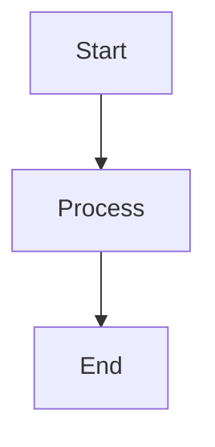

# Omnicore Markdown Viewer

A feature-rich markdown preview for VS Code with Mermaid diagrams, OmniWare wireframes, interactive tables, and PrismJS syntax highlighting.

## Features

### Rich Markdown Preview

- **Full HTML support** with DOMPurify sanitization
- **GitHub-Flavored Markdown** via the `marked` library
- **Dark mode** that automatically follows your VS Code theme

### Mermaid Diagrams

Render all Mermaid diagram types directly in the preview. Click the maximize button to open a diagram in a full-screen popup with **pan** (click & drag) and **zoom** (scroll wheel) controls.

~~~markdown

~~~

### OmniWare Wireframes

Render OmniWare DSL wireframes inline. Supports `.ow` files and `omniware` code blocks within markdown. Includes popup view.

~~~markdown
```omniware
page "Login" {
  header "Welcome Back"
  input "Email"
  input "Password" type=password
  button "Sign In"
}
```
~~~

### Interactive Tables

Markdown tables automatically get a maximize button. Click it to open an interactive view powered by **Tabulator.js** with:

- Column sorting and filtering
- Pagination (25, 50, 100, 200 rows)
- Movable and resizable columns
- Export to **CSV** and **JSON**

### Syntax Highlighting

**PrismJS** with the Solarized Light theme highlights code blocks in 11+ languages including JavaScript, TypeScript, Python, Java, C/C++, C#, CSS, HTML, JSON, Bash, and SQL. Each code block includes a **copy-to-clipboard** button.

### Search

Press `Ctrl+F` in the preview to open the search panel with real-time highlighting, match counter, and prev/next navigation.

### Table of Contents

Auto-generated from all document headers (H1-H6) with hierarchical indentation. Click any entry to jump to that section.

### Zoom

Zoom the preview from 50% to 200% using toolbar buttons, keyboard shortcuts (`Ctrl+Plus` / `Ctrl+Minus`), or `Ctrl+Scroll`.

### Formatting Commands

Quickly format markdown text in the editor:

| Command | Shortcut | Description |
|---------|----------|-------------|
| Toggle Bold | `Ctrl+B` | Wrap selection with `**` |
| Toggle Italic | `Ctrl+I` | Wrap selection with `*` |
| Toggle Code | Command Palette | Wrap with backticks or code fences |
| Toggle List | Command Palette | Add/remove `- ` list markers |
| Remove Formatting | Command Palette | Strip all markdown formatting |

### Recent Files Sidebar

A dedicated panel in the activity bar tracks your last 100 opened files. Right-click entries to open the containing folder or copy the file path. Supports individual delete and clear all.

## Supported File Types

| Extension | Type |
|-----------|------|
| `.md`, `.markdown`, `.mdown`, `.mkd`, `.mkdn` | Markdown |
| `.mmd`, `.mermaid` | Mermaid Diagram |
| `.ow` | OmniWare Wireframe |

## Keyboard Shortcuts

| Command | Windows / Linux | Mac |
|---------|----------------|-----|
| Open Preview | `Ctrl+Shift+V` | `Cmd+Shift+V` |
| Open Preview to Side | `Ctrl+K V` | `Cmd+K V` |
| Toggle Bold | `Ctrl+B` | `Cmd+B` |
| Toggle Italic | `Ctrl+I` | `Cmd+I` |
| Search (in preview) | `Ctrl+F` | `Cmd+F` |
| Zoom In | `Ctrl+Plus` | `Cmd+Plus` |
| Zoom Out | `Ctrl+Minus` | `Cmd+Minus` |
| Reset Zoom | `Ctrl+0` | `Cmd+0` |

## Commands

Open the Command Palette (`Ctrl+Shift+P`) and type **Omnicore** to see all available commands:

- **Omnicore: Open Preview** - Open preview in current panel
- **Omnicore: Open Preview to the Side** - Open preview in a side panel
- **Omnicore: Toggle Bold / Italic / Code / List** - Format selected text
- **Omnicore: Remove Formatting** - Strip markdown formatting from selection

## What Makes This Different

| Feature | Omnicore | VS Code Built-in |
|---------|----------|------------------|
| Mermaid Diagrams | Full rendering + pan/zoom popup | Not supported |
| OmniWare Wireframes | Full rendering + popup | Not supported |
| Interactive Tables | Sorting, filtering, export | Static only |
| In-preview Search | Highlighting + navigation | Not available |
| Table of Contents | Clickable panel | Outline view only |
| Zoom | 50%-200% + mouse wheel | Not available |
| Code Copy Buttons | One-click copy | Manual selection |
| Formatting Shortcuts | Bold, italic, code, list | Not available |

## Requirements

- VS Code 1.85.0 or later

## License

[MIT](https://opensource.org/licenses/MIT)

## Credits

Developed by [Omnicore](https://www.omnicore.com.tr)
